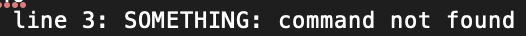
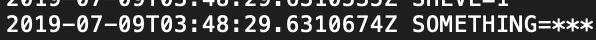

Running into some issues with interoplating the values from the environment when they are secrets injected into Azure DevOps from a variable group. Everytime I try to use the value I get an error that says: 

Yet, when I print out the environment variables on the agent I see the variable is bring pulled in from the variable group.

